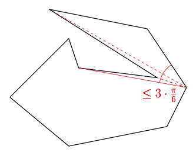
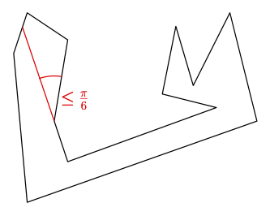

# The Angular Art Gallery Problem

## Assumed Upper Bound
Given a polygon with `n` vertices, a tight upper bound of `(n - 1) * π/6` is assumed. To get a solution satisfying
this bound, the polygon is partitioned recursively, using different rules (so-called partitioning patterns), until each 
subpolygon fulfills one of the base cases.

### Base cases
- The polygons size is smaller than six
- The polygon is convex

### Partitioning patterns

#### Cutting small triangles
Given three consecutive vertices forming an empty triangle (no other vertex is inside) with one inner angles `≤ π/6`, 
this triangle may be cut off.


#### _Radius pattern_
Consider three consecutive vertixes. Find another vertex outside a specific circle, visible by all three consective
vertices. If the radius of the circle is large enough, a floodlight with an angle `≤ π/6` on this vertex can partition
the polygon into two smaller ones. The circle is defined according to the 
[inscribed angle theorem](https://en.wikipedia.org/wiki/Inscribed_angle#Theorem).


#### _Duct Pattern_: Partition at slim quadrilaterals
Given two non-consecutive edges forming a slim quadrilateral with an inner covering angle `≤ pi/6`, this quadrilateral
may be cut off, resulting in two smaller subpolygons. The quadrilateral is either covered by one floodlight, covering
one inner angle, or by two floodlights on opposite sides, covering one diagonal half each.


#### Convex subpolygons 
This is the generalization of the first case, searching not for triangles, but for general convex polygons. A convex 
k-gon with the smallest inner angle `≤ (k - 2) * π/6` can be cut off.


#### Histogram pattern
The rays, extending the two edges of a non-convex vertex inside the polygon intersect with the same polygon edge. 
The polygon can be partitioned into two smaller ones without placing a floodlight.


#### One non-convex vertex pattern
Cut off a k-gon with one non-convex vertex, if there is a floodlight position, covering the whole subpolygon with
an angle `≤ (k - 2) π/6` (Every vertex is visible by the floodlight vertex).



#### Edge extension pattern
If the edge extension of a non-convex vertex forms a convex k-gon, whose smallest inner angle is 
`≤ (k - 2) π/6`, it can be cut off.



## Benchmark/Results
The algorithm was tested on different benchmark sets. From 493019 polygon instances, only 111 couldn't be solved by the 
algorithm. A list of the unsolved instances can be found [here](benchmark_results/benchmark_results.txt), including a 
[figure](benchmark_results/unsolved.png), visualizing all unsolved instances.

| Instance set | Tested | Unsolved | Comment |
| ---      |  ------  |----------| --------:|
| random-small-int   | 181958 | 40 | Randomly created polygons with sizes of 10, 20, 30 and 40 on a 100x100 grid |
| random-small-float | 296220 | 64 | Randomly created polygons with sizes of 10, 20, 30, 40, 50 and 60 |
| random-large-float | 40 | 1 | Randomly created polygons with sizes of sizes 500 and 1000 |
| AGPLIB/AGP2007* | 10282 | 3 | Mostly randomly created, orthogonal polygons |
| AGPLIB/AGP2008a* | 1833 | 0 |  |
| AGPLIB/AGP2008b* | 1063 | 1 |  |
| AGPLIB/AGP2009a* | 1623 | 2 |  |

* Only instances with a size ≤ 2000 were tested.

## Implementation

### Build
The implementation depends on [CGAL](https://www.cgal.org) and [boost](https://www.boost.org). The used build tool is 
[CMake](https://cmake.org). On macOs, dependencies 
can be installed using [Homebrew](https://brew.sh):
```
brew update
brew install cmake cgal boost
```

The release version can be built using CMake:
```
mkdir release && cd "$_"
cmake -DCMAKE_BUILD_TYPE=Release ..
make
```


### Run
To solve a single polygon instance, the `aagp` command line tool can be used. The parameters are
- `-o` Output directory
- `-f <path>` Path to instance file (Can also be passed as last argument without `-f`)
- `-r <size>` Create and solve random polyon of specified size (ignored, if combined with `-f`)

_Example_:
```
# Create a random polygon of size 50 and solve
./aagp -o out -r 50 

# Solve polygon instace from file
./aagp resources/instances/polygon.pol
```

#### Benchmark
The benchmark tool is designed to run the algorithm for a larger set of polygon instances. The instance sets can be
specified with the following two parameters:
- `-b <dir>` specifies the base instances directory. This part of the instance path will be ignored in the output 
structure.
- `-i <instance set>` solves all instances (files ending with _.pol_) in the directory `<instance set>` (relative to
 base dir). Can be specified multiple times (Can also be passed as last argument without `-i`).
- `-o <dir>` Output directory. Within, the relative pathes of the instance sets are used.  
- `-v` If set, each partitioning step is visualized and saved in an svg file.
- `-m <size>` Specifies the maximum size of polygon that should be considered. All larger polygons in the set are 
ignored.

_Example_: Solve all instances of in the directories `resources/instances/AGPLIB/StSerninH` and 
`AGPLIB/AGP2007/agp2007-fat` with a size smaller than or equal to 50 and save visualizations to `out`:

```
./benchmark -b resources/instances -o out -v -m 50 -i AGPLIB/StSerninH -i AGPLIB/AGP2007/agp2007-fat
```

The command line output can be redirected to a file using `tee`:
```
./benchmark -b resources/instances AGPLIB/StSerninH 2>&1 | tee results.txt
```

#### Random polygon creation
Generated instances are stored in `resources/instances` by default, but the output directory can be specified by 
`-o <dir>`. The used algorithm can be found 
[here](https://doc.cgal.org/latest/Generator/group__PkgGeneratorsRef.html#gaa8cb58e4cc9ab9e225808799b1a61174) and has a 
runtime of `O(n^4 log n)`.

_Example_: Generate 50 random polygons of size 10, 20 and 30 and 10 polygons of size 50 and 100. 
```
./generate_random -r 50:10,20,30 -r 10:50,100 
```

### Instance format
The instance format follows the one specified in the 
[AGPLIB](https://www.ic.unicamp.br/~cid/Problem-instances/Art-Gallery/AGPVG/index.html). The file extension is `.pol`.
Instances are defined as a sequence of numbers, beginning with the polygon size, followed by pairs of numbers, defining
the vertex coordinates. The vertex coordinates are either integers, floats or fractions of integers 
(`num/den`). Line breaks are ignored.

Example: A polygon with five vertices.

```
5 0 0 34/2 2/5 3 3 5.4 0.2 5 10 1 8
```

### Output visualization


The tool produces svg images of the partitioning steps of the algorithm. For some patterns, e.g. the small
triangle pattern, multiple split steps are combined into one figure to reduce the number of output files. The already 
covered areas are filled grey, the initial polygon is indicated with a grey border and the currently considered 
subpolygon has a black border. The used split segments are highlighted in red.

### Pitfalls
- A degenerated case that is not handled currently occurs, if the edge extension in the histogram pattern intersects not
with a polygon edge, but with a vertex. If this case occurs, it is ignore, even if a split would be possible.
- Almost everywhere, only the exact cosines of the angles are computed and compared, which leads to exact results. But
in the duct pattern, the diagonal angles need to be summed up. In this case, interval arithmetic is used to compute 
intervals of the angles. The interval upper bound is used for further split decision, which should keep the results 
valid:
    ```
  (a + b).upper() < (pi / 6).lower() # a and b are the intervals of the angles
    ```
- The convex subpolygon pattern and the one non-convex vertex subpolygon pattern cannot be seperated completely, since
the first one checks also one case of the latter one.
- Due to a [bug in CGAL](https://github.com/CGAL/cgal/issues/1445), the random polygon generator 
(`cgal_helpers/random_polygon_generator.h`) is restricted to generate polygons only from point sets with no three 
collinear points. Although, it ends up in an infinity loop sometimes.

### Implementing a new Pattern
Each pattern is a class, inherited from the abstract base class `upper_bound/base_pattern.h`. All patterns are located 
in `upper_bound/patterns/`. Implement the `description` method and  the `split` method, which returns true, iff the 
polygon matches the pattern and is partitioned accordingly. The executed partitioning should also be visualized with the
`viualizer` object of the `split` method. If multiple successive split steps of the pattern should be combined in one 
visualization figure, override the `combine_visualizations` method. Take a look at the other pattern implementations to
get a detailed overview, the structures are all very similar.

The name of the new pattern needs to be added to the enum `Pattern` in the file 
`upper_bound/patterns/pattern_manager.h`. A static instance of the pattern has to be declared and initialized in
`upper_bound/patterns/pattern_manager.cpp` and the `switch` statement in the file has to be extended accordingly.